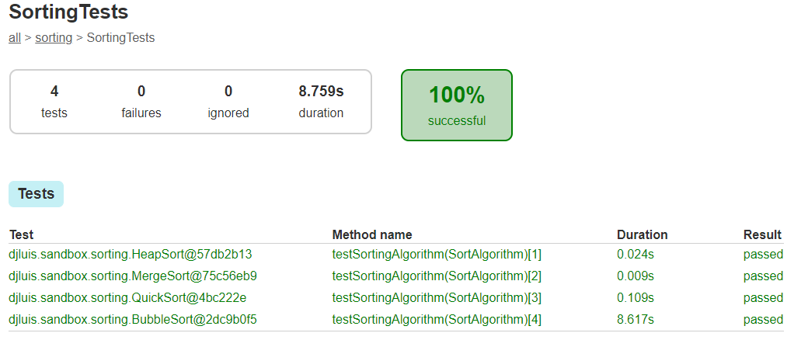

# JavaSandbox

Just a safe java repo for some geek experiences

# Sorting Algorithms

I have created a setup to test and compare multiple Sorting Algorithms.
They have been built with simplicity in mind, for the sake of readability

## Standard Implementations :tired_face: (Boring versions, only used for elementary school to teach kids how to sort and array)

| Algorithm  |Time complexity|Space complexity|    Is Recursive    |                Notes                |
|------------|:-------------:|:--------------:|:------------------:|:-----------------------------------:|
| Quick Sort | O(n * log n)  |    O(log n)    | :white_check_mark: |:warning: If sorted -> O(n^2) :snail:|
| Merge Sort | O(n * log n)  |      O(n)      | :white_check_mark: |               Stable                |
| Heap Sort  | O(n * log n)  |      O(1)      | :white_check_mark: |             Not Stable              |
| Buble Sort |    O(n^2)     |      O(1)      |        :x:         |      :snail:    Stable :snail:      |

* n -> Array size

## Where the fun begins :heart_eyes:

### WIP

Only non recursive and "stable" algorithms are welcomed here. If you can't hold bick dick arrays without causing stack overflow so please leave now. 

| Algorithm  |Time complexity|Space complexity|    Is Recursive    |                Notes                |
|------------|:-------------:|:--------------:|:------------------:|:-----------------------------------:|
| Quick Sort Random pivot                    | O(n * log n)  |    O(log n)    | :x: |                    |
| Quick Sort + Selection Sort with threshold | O(n * log n)  |    O(log n)    | :x: |                    |
| Parallel Merge Sort                        | O(n * log n)  |      O(n)      | :x: |                    |

## Result

# Search Algorithms

## WIP

| Algorithm                       |Time complexity|Space complexity|   Is Recursive   |           Notes            |
|---------------------------------|:-------------:|:--------------:|:----------------:|:--------------------------:|
| Breadth First Search (aka BFS)  |   O(V + E)    |      O(V)      |       :x:        | Auxiliary structure: Queue |
| Depth-first traversal (aka DFS) |   O(V + E)    |      O(V)      |:white_check_mark:|                            |

* v -> Vertices
* e -> Edges

# Disclaimer
This is not a benchmark, for that multiple consecutive runs are mandatory to obtain a precise measure to avoid any
JIT compile suprises
